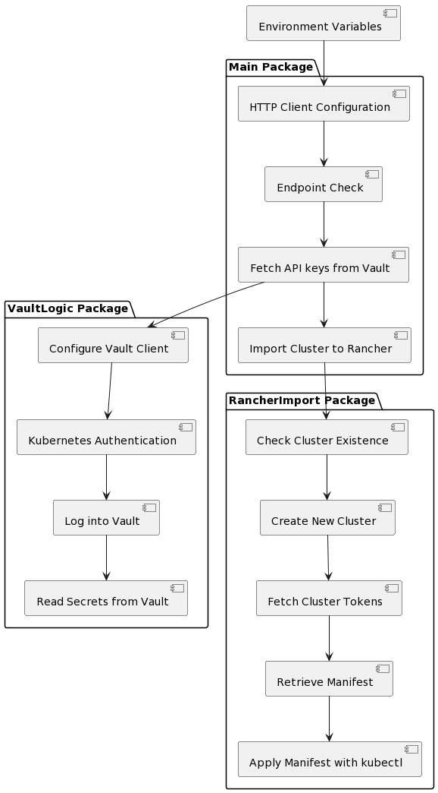

# Documentation for Rancher import code

## Introduction

The provided code consists of three packages:
- A main package, which contains the principal logic of the application.
- A `vaultlogic` package that handles fetching secrets from HashiCorp's Vault using Kubernetes authentication.
- A `rancherimport` package, which is responsible for importing a Kubernetes cluster into Rancher.

## Overview

The primary purpose of this code is to import a pre-existing Kubernetes cluster into Rancher. The main package's logic orchestrates this by first preparing the HTTP client and then checking if a specific endpoint is accessible. Once these preliminary checks are successful, the code leverages both the vault logic and rancher import logic to complete the cluster registration process in Rancher.
## Architecture

### Configuration and Execution:

#### Environment Variables:
- `RANCHER_SERVER`: URL of the Rancher server.
- `USERNAME`: Username for the Rancher server. Defaults to `admin`.
- `SKIP_TLS_VERIFY`: If set to `true`, the HTTP client will skip TLS verification. Otherwise, it uses a regular HTTP client.
- `VAULT_ADDR`: Address of the Vault server.
- `VAULT_SECRET_ENGINE`: The secret engine name in Vault. Defaults to `kv-v2`.
- `VAULT_SECRET_PATH`: The path to the secret in Vault. Defaults to `creds`.
- `CLUSTER_NAME`: The name of the downstream cluster.

#### Main Logic:
1. Configure HTTP client based on environment variables.
2. Repeatedly checks if the `RANCHER_SERVER` endpoint is accessible.
3. Fetches the API keys from Vault using Kubernetes authentication.
4. Calls the `ImportClusterToRancher` function from the `rancherimport` package to complete the import process.

### Vault Logic:

This logic is encapsulated in the `vaultlogic` package.
- The `GetSecretWithKubernetesAuth` function is the primary method to fetch secrets.
    - Configures the Vault client and Kubernetes authentication.
    - Logs into Vault using Kubernetes authentication.
    - Reads the required secrets from Vault.
    - Returns the secrets.

### Rancher Import Logic:

This logic is housed in the `rancherimport` package.
- `ImportClusterToRancher`: Main function to initiate the import process.
    - Checks if a cluster with a given name already exists.
    - Creates a new cluster in Rancher.
    - Fetches the cluster registration tokens.
    - Retrieves the manifest from the provided manifest URL.
    - Uses `kubectl` to apply the manifest, thereby importing the cluster to Rancher.
- `doesClusterExist`: Helper function to check if a given cluster name already exists in Rancher.

## Requirements:
- The environment must have `kubectl` command available.
- Necessary permissions in both Rancher and Vault.
- The application should have the appropriate RBAC in Kubernetes to perform operations.

## How to Run

    Ensure that all environment variables are set.
    Build the project: make build-push    
    Install on Kubernetes cluster:    
      kubectl apply -f -R deploy/
## Conclusion:

This application is designed to automate the process of importing a Kubernetes cluster into Rancher using information stored in Vault. Proper configuration and permissions are crucial for its successful execution.
